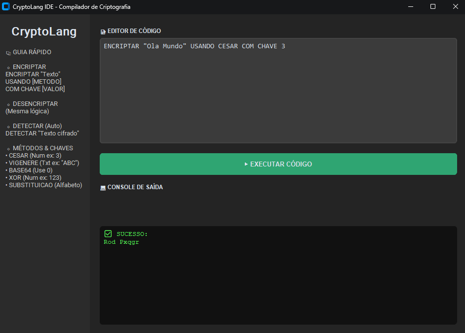

# 🔒 CryptoLang IDE

  

**CryptoLang** é uma IDE e Compilador de Criptografia desenvolvido com foco educacional. O projeto implementa um pipeline completo de engenharia de compiladores (Lexer, Parser e Interpreter) para processar uma linguagem de domínio específico (DSL) criada para operações de segurança da informação.

O sistema permite encriptar e desencriptar mensagens usando diversos algoritmos clássicos, além de possuir uma funcionalidade de **Criptoanálise Automática** que utiliza análise estatística e dicionários para identificar e quebrar cifras desconhecidas.

---

## 📸 Interface Visual




---

## ✨ Funcionalidades Principais

### 1. Compilador Dedicado
Diferente de scripts comuns, este projeto processa comandos através de fases reais de compilação:
- **Análise Léxica:** Tokenização do código fonte.
- **Análise Sintática:** Validação gramatical e construção da AST (Árvore de Sintaxe Abstrata).
- **Interpretação:** Execução lógica dos nós da árvore.

### 2. Algoritmos Suportados
- **Cifra de César:** Deslocamento simples de caracteres.
- **Cifra de Vigenère:** Cifra polialfabética usando chave de texto.
- **XOR Cipher:** Operação bit-a-bit (segurança computacional).
- **Base64:** Codificação de dados binários em texto.
- **Substituição:** Troca de alfabeto completa baseada em chave de 26 caracteres.

### 3. 🕵️ Detecção Automática (Smart Detect)
O sistema possui um módulo de inteligência que analisa textos cifrados sem saber a chave ou o método.
- Realiza ataques de força bruta inteligentes.
- Utiliza a biblioteca `pyspellchecker` para validar palavras em **Português** e **Inglês**.
- Retorna o algoritmo provável, a chave encontrada e o nível de confiança (%).

### 4. Interface Gráfica (GUI)
- Desenvolvida com **CustomTkinter**.
- Design moderno, responsivo e com modo escuro nativo.
- Feedback visual de erros de sintaxe e execução.

## 🛠️ Instalação e Uso

### Pré-requisitos
Certifique-se de ter o [Python](https://www.python.org/) instalado em sua máquina.

### 1. Clonar o repositório
```bash
git clone [https://github.com/seu-usuario/cryptolang.git](https://github.com/seu-usuario/cryptolang.git)
cd cryptolang
```

### 2. Instalar dependências

Este projeto utiliza bibliotecas externas para renderização da GUI
moderna e para o dicionário inteligente da linguagem.

``` bash
pip install customtkinter pyspellchecker
```

## ▶️ Executar o projeto

Para iniciar a IDE, execute o arquivo principal na raiz do projeto:

``` bash
python crypto_ide.py
```

# 📙 Documentação da Linguagem CryptoLang

A **CryptoLang** foi projetada para ser legível e intuitiva,
aproximando-se da linguagem natural.\
A seguir estão os padrões de comando suportados pelo interpretador.

## 🔐 Encriptar e Desencriptar

Use esta sintaxe quando você já conhece o método criptográfico e a
chave:

**Sintaxe:**

    AÇÃO "TEXTO" USANDO ALGORITMO COM CHAVE VALOR

### Exemplos:

``` plaintext
# Cifra de César (Chave Numérica)
ENCRIPTAR "Ataque ao amanhecer" USANDO CESAR COM CHAVE 3

# Cifra de Vigenère (Chave Texto)
ENCRIPTAR "Documento Secreto" USANDO VIGENERE COM CHAVE "SENHA"

# Base64 (Chave é ignorada, use 0)
ENCRIPTAR "Dados do Servidor" USANDO BASE64 COM CHAVE 0

# Desencriptar (Processo inverso)
DESENCRIPTAR "Dwdtxh dr dpdqkhfhu" USANDO CESAR COM CHAVE 3
```

## 🔎 Detecção Automática

Use este comando quando o texto cifrado é desconhecido e você deseja
identificar a cifra usada (brute-force inteligente).

**Sintaxe:**

    DETECTAR "TEXTO CIFRADO"

### Exemplo:

``` plaintext
DETECTAR "Um texto que voce nao sabe como foi gerado"
```

O console exibirá o algoritmo detectado e a tradução sugerida com base
na pontuação das palavras válidas identificadas.

# 🧠 Arquitetura Técnica

A arquitetura segue um pipeline tradicional de construção de linguagens:

### Lexer (Tokenizador)

Lê o texto caractere por caractere e gera uma lista de *tokens*
categorizados (ex.: `TT_KEYWORD`, `TT_STRING`).

### Parser (Analisador Sintático)

Verifica se os tokens seguem a gramática da linguagem. Caso positivo,
produz uma **AST (Árvore de Sintaxe Abstrata)**.

### Interpreter (Visitante)

Percorre a AST e executa as operações criptográficas correspondentes.

### Cryptanalyst

Módulo estatístico que carrega dicionários em memória e pontua frases
com base na frequência de palavras reais em PT/EN para validar
tentativas de quebra de cifra.

# 📦 Tecnologias Utilizadas

-   **Linguagem:** Python 3.8+
-   **GUI:** CustomTkinter (interface moderna baseada em Tcl/Tk)
-   **Processamento de Linguagem Natural:** Pyspellchecker
-   **Core:** Bibliotecas padrão (`string`, `base64`, `threading`)